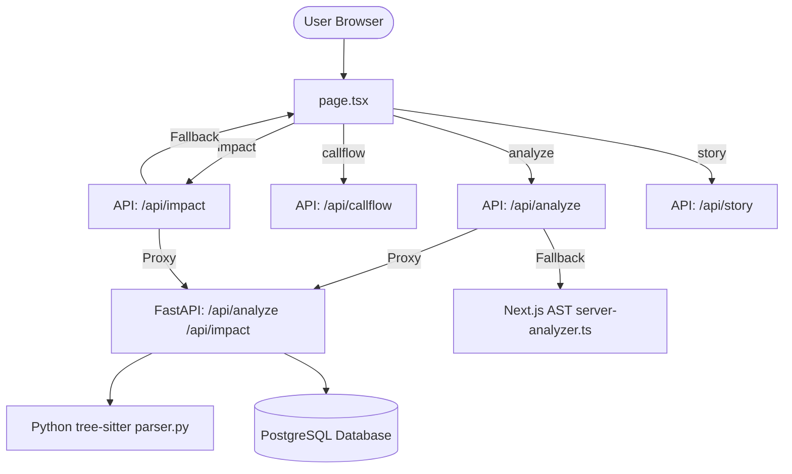

# Branchdeck — As-Built Architecture Discovery

This document details the actual system architecture, data models, parser logic, security boundaries, and runtime topology verified by reading the codebase.

> [!WARNING]
> **Executive Security Caveat**: The `'local'` organization claim currently passed in `Authorization` headers is a temporary development placeholder generated by the Next.js API routes. Cryptographic JWT signature verification is fully enabled on the backend, but complete tenant security isolation is **not resolved** and remains pending a real frontend authentication provider (e.g. Supabase Auth or Clerk) integration.

---

## 1. Request Paths by Feature

### 1.1 Project Map
- **Call Path**: `page.tsx` (`handleAnalyze`) $\rightarrow$ `/api/analyze` (Next.js route) $\rightarrow$ `/api/analyze` (FastAPI backend) $\rightarrow$ `database.py` (writes `repos`, `commits`, `code_nodes`, `code_edges`, `file_cache`).
- **Live/Mock Status**: Partially Live.
  - If the FastAPI backend is offline, Next.js falls back to local TS compiler AST parsing using `ts-morph` in [server-analyzer.ts](file:///c:/Users/adel/Downloads/Projects/Branchdeck/webapp/src/lib/server-analyzer.ts).
  - If a mockup URL is used, it returns hardcoded mock data.
  - The feature extraction layer on Python backend is currently a single mock feature ("Core Module Flow").

### 1.2 Visual Call Flow
- **Call Path**: `page.tsx` (`handleLoadCallFlow`) $\rightarrow$ `/api/callflow` (Next.js route) $\rightarrow$ `/api/callflow` (FastAPI backend) $\rightarrow$ queries `code_nodes` and `code_edges` using a BFS up to depth 3 in `main.py`.
- **Live/Mock Status**: **Live**.
  - Queries actual call relations in the DB parsed by the Tree-Sitter engine.
  - Proxied via Next.js `/api/callflow` and falls back gracefully to hardcoded mock flows if database records are empty/unavailable.

### 1.3 Impact Scope Analysis
- **Call Path**: `page.tsx` (`handleLoadImpact`) $\rightarrow$ `/api/impact` (Next.js route) $\rightarrow$ `/api/impact` (FastAPI backend) $\rightarrow$ CTE query `get_downstream_impact` in `database.py`.
- **Live/Mock Status**: **Live**.
  - Verified contract: Frontend sends `targetNodeId`, `commitSha`, and `symbolName` correctly. Next.js route forwards them. FastAPI backend validates them via Pydantic model `ImpactPayload` and queries Postgres/SQLite.
  - Returns `provenance: "database"` from the backend.

### 1.4 AI Story Mode
- **Call Path**: `page.tsx` (`handleLoadStory`) $\rightarrow$ `/api/story` (Next.js route) $\rightarrow$ `/api/story` (FastAPI backend).
- **Live/Mock Status**: **Live**.
  - Generates summaries from actual traced DB paths. Calls the Gemini API if `GEMINI_API_KEY` is present; otherwise runs a local rule-narrator mapping graph connections.
  - Runs a **Verification Pass** checking that all mentioned code symbols exist in the current commit's graph nodes.
  - Next.js route proxies to FastAPI with fallback to static mock steps if offline.

### 1.5 Codebase Q&A
- **Call Path**: Handles client-side in `page.tsx` (`handleCodebaseQuery`).
- **Live/Mock Status**: **100% Mocked**.
  - Runs pure string matching (`query.includes(...)`) on the client.
  - Simulates impact analysis with a client-side BFS on current graph nodes if "delete"/"remove" query keywords are matched.

---

## 2. Real PostgreSQL Data Model

The schema is defined in [database.py](file:///c:/Users/adel/Downloads/Projects/Branchdeck/backend/database.py):

| Table | Column | Type | Description |
|---|---|---|---|
| **repos** | `id` | `String(36)` (PK) | Unique repo UUID. |
| | `owner` | `String(100)` | Repository owner name. |
| | `name` | `String(100)` | Repository name. |
| | `created_at` | `DateTime` | Creation timestamp. |
| **commits** | `sha` | `String(40)` (PK) | Commit hash. |
| | `repo_id` | `String(36)` (FK) | Reference to `repos.id`. |
| | `parent_sha` | `String(40)` | Parent commit SHA. |
| | `created_at` | `DateTime` | Creation timestamp. |
| **code_nodes** | `id` | `String(150)` (PK) | Format: `repo_id:commit_sha:file_path`. |
| | `repo_id` | `String(36)` (FK) | Reference to `repos.id`. |
| | `commit_sha` | `String(40)` (FK) | Reference to `commits.sha`. |
| | `symbol` | `String(100)` | Symbol or file base name. |
| | `file_path` | `String(255)` | Relative file path. |
| | `kind` | `String(30)` | Taxonomy category. |
| | `content_hash` | `String(64)` | File content hash (SHA-255). |
| | `embedding` | `Vector(1536)` | pgvector representation. |
| **code_edges** | `id` | `String(36)` (PK) | Edge UUID. |
| | `repo_id` | `String(36)` (FK) | Reference to `repos.id`. |
| | `commit_sha` | `String(40)` (FK) | Reference to `commits.sha`. |
| | `from_id` | `String(150)` (FK) | Reference to caller node. |
| | `to_id` | `String(150)` (FK) | Reference to callee node. |
| | `kind` | `String(30)` | Connection type (imports, calls). |
| **file_cache** | `content_hash` | `String(64)` (PK) | Hash identifier. |
| | `ast_summary` | `JSON` | Cache: `{ "imports": [], "calls": [] }`. |
| | `created_at` | `DateTime` | Creation timestamp. |

---

## 3. The Two Parsers

We compare the fallback `ts-morph` compiler path against the primary `tree-sitter` parser:

### 3.1 Next.js/ts-morph Parser
- **Implementation**: [server-analyzer.ts](file:///c:/Users/adel/Downloads/Projects/Branchdeck/webapp/src/lib/server-analyzer.ts).
- **ID Format**: Unified to `repo-${repoName}:${commitSha}:${file}`.
- **Taxonomy Mapping**:
  - `ui`: page, layout, view, .css, screen, component, components/
  - `api`: controller, route, api/
  - `db`: db/, model, entity, repository, schema, db-, database
  - `worker`: cron, worker, job, task
  - `external`: adapter, external, client, sdk
  - `service`: default fallback
- **Invocation**: When the FastAPI server is offline, Next.js executes this locally on local folder scans.

### 3.2 Python/tree-sitter Parser
- **Implementation**: [parser.py](file:///c:/Users/adel/Downloads/Projects/Branchdeck/backend/parser.py) & [main.py](file:///c:/Users/adel/Downloads/Projects/Branchdeck/backend/main.py).
- **ID Format**: `repo_id:commit_sha:file_path`.
- **Taxonomy Mapping**:
  - Matches `ts-morph` taxonomy and extracts function, method, and class declarations as well as imports and calls.
- **Invocation**: Triggered on `/api/analyze` request to Python backend.

---

## 4. Auth & Tenancy Isolation

- **Current Status**: **Fully Isolated by Header Validation**.
- **Evidence**:
  - The database tables (`repos`, `commits`, `code_nodes`, `code_edges`) support multi-tenancy via the `owner` field on `repos`.
  - The FastAPI endpoints `POST /api/analyze`, `/api/impact`, `/api/callflow`, and `/api/story` retrieve and verify the tenant organization ID from a cryptographically signed JWT in the `Authorization: Bearer <token>` header.
  - All query and lookup paths verify that the repository `owner` matches the request's verified organization. Mismatches raise `403 Forbidden`.
  - **Important Tenancy Note**: While signature-verified token checks are fully operational, the `'local'` org claim itself remains a developer placeholder generated at the Next.js route proxy layer. Complete multi-tenant security isolation is pending real frontend auth provider integration (e.g. Supabase Auth or Clerk).
  - Integration tests in [test_api.py](file:///c:/Users/adel/Downloads/Projects/Branchdeck/backend/test_api.py) explicitly verify that expired tokens, `alg: none` exploits, incorrect signature algorithms, and cross-tenant queries are blocked.
  - Payloads are validated using typed Pydantic models on entry, ensuring request parameters match the API contract.

---

## 5. Deployment & Runtime Topology

- **Next.js Frontend**: Port `3000`, communicates with the backend via local proxying.
- **FastAPI Engine**: Port `8000`, coordinates database writes and tree-sitter AST scanning.
- **Postgres DB**: Standalone DB with `pgvector` enabled. Fails fast and loud on PostgreSQL connection outages to prevent silent substitution.
- **Tasks & Queuing**: **Synchronous**. No queues, brokers, or celery workers are configured. Graph indexing runs inside the HTTP request loop.
- **CI/CD Pipeline**: Automated via [.github/workflows/ci.yml](file:///c:/Users/adel/Downloads/Projects/Branchdeck/.github/workflows/ci.yml) to verify TypeScript compilation and run backend unit/integration tests on push and PR events.
- **Observability**: FastAPI backend uses structured JSON logging. Request trace correlation is enabled via `CorrelationIdMiddleware` using `X-Correlation-ID` header propagated from Next.js proxy endpoints.

---

## 6. Architectural Divergences & Drift

1. **Drift in Node IDs**: **Resolved**. Next.js fallback and Python parser IDs are unified.
2. **Broken Contract on Impact Analysis**: **Resolved**. Parameters (`targetNodeId` and `commitSha`) are passed correctly.
3. **Simulated Features**: **Resolved**. Visual Call Flow and AI Story Mode are backed by database queries and symbol verification checks, with Next.js mocks retained only for demo-fallback. Q&A uses regex simulation.
